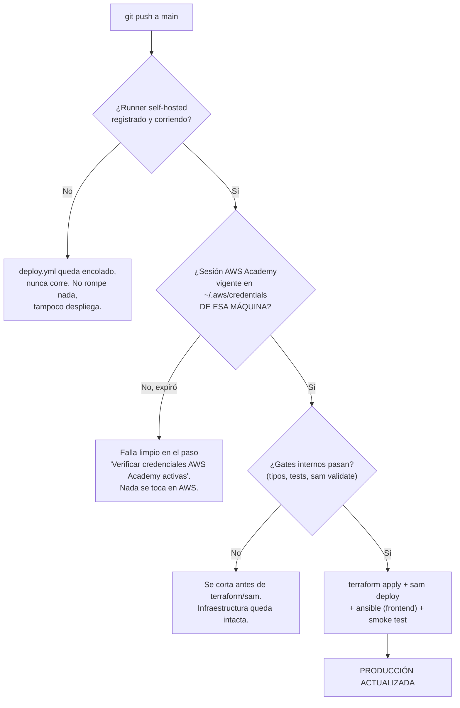

# Misión Emprende UDD

Juego educativo serverless desplegado en AWS para la asignatura **Bases de Datos Avanzadas / Arquitectura de Sistemas** de la Universidad del Desarrollo. Los grupos avanzan por fases de emprendimiento en tiempo real, guiados por un profesor desde un panel de control.

> **Estado actual:** backend de las 6 fases del juego implementado y probado; frontend jugable para fases 1-3 (Sopa de Letras, Bubble Map, LEGO + evidencia fotográfica). Las fases 4-6 (pitch, evaluación cruzada, ranking) tienen lógica de dominio completa pero sin interfaz aún — ver `documentosProyecto/informeFinalExamenArquiAnascoRuizRiquelme.md` para el detalle de pendientes.

---

## Arquitectura

```
┌─────────────────────────────────────────────────────────────┐
│                        Alumno / Profesor                     │
│         Browser → S3 Static Website (modo Academy: HTTP)     │
└─────────────────────────┬───────────────────────────────────┘
                          │
                          ▼
              ┌───────────────────────┐
              │ API Gateway (HTTP)    │
              │ JWT Authorizers       │──── Cognito (Pool Profesores + Pool Grupos)
              └───────────┬───────────┘
                          │
              ┌───────────▼───────────┐
              │   AWS Lambda (x12)    │
              │   TypeScript (Node 22)│
              │   acceso / sesiones / │
              │   profesor / fase1-5  │
              │   analytics /         │
              │   fotografias (x3)    │
              └───────────┬───────────┘
                          │
        ┌─────────────────▼──────────────────┐        ┌──────────────┐
        │        DynamoDB Global Tables       │        │ S3 Multimedia │
        │  us-east-1 (primaria) ←──────────→ │        │ + SQS + DLQ   │
        │  us-west-2 (réplica)               │        │ (fotos LEGO)  │
        │  Single-table design: PK/SK + GSI1 │        └──────────────┘
        └─────────────────────────────────────┘

IaC: Terraform (infraestructura) + AWS SAM (Lambdas/API) + Ansible (build & deploy)
CI/CD: GitHub Actions -- ci.yml (gates, sin AWS) + deploy.yml (despliegue real, runner self-hosted)
```

**Recursos creados por Terraform (`main.tf`):**
- DynamoDB Global Table `MisionEmprende-prod` con réplica activa-activa en `us-west-2`
- S3 bucket frontend (modo Academy: static website hosting HTTP; modo no-Academy: privado detrás de CloudFront)
- S3 bucket multimedia (fotos LEGO, retención de 30 días) + notificación a SQS
- S3 bucket data lake + Athena (KPIs, épica 5)
- SNS tema de alarmas + 5 alarmas CloudWatch + SQS/DLQ de fotografías

**Recursos creados por SAM (`backend-serverless/template.yaml`):**
- 12 funciones Lambda: `acceso`, `profesor`, `sesiones`, `fase1`…`fase5`, `analytics`, `fotografias` (api + consumidor + reconciliador)
- API Gateway HTTP con dos JWT Authorizers (uno por Cognito User Pool: profesores y grupos)
- Cognito: `PoolProfesores`, `PoolGrupos`, sus respectivos App Clients y grupos (`PROFESOR`, `GRUPO`)

---

## Estructura del repositorio

```
├── main.tf                        # Infraestructura AWS (Terraform)
├── .github/workflows/
│   ├── ci.yml                     # Gates de calidad en cada push (sin permisos AWS)
│   └── deploy.yml                 # Despliegue real a producción (runner self-hosted)
├── ansible/
│   └── deploy.yml                 # Playbook: build + deploy backend + frontend
├── backend-serverless/
│   ├── template.yaml              # Definición SAM (Lambdas + API Gateway + Cognito)
│   ├── samconfig.toml             # Configuración de despliegue SAM
│   ├── scripts/bootstrapProfesor.ts  # Crea/asegura una cuenta de profesor en Cognito
│   ├── src/
│   │   ├── acceso/                # Autenticación alumnos y profesor
│   │   ├── sesiones/               # Estado de la sesión activa
│   │   ├── profesor/               # Panel de control del profesor
│   │   ├── fase1/ … fase5/         # Lógica de cada fase del juego
│   │   ├── analytics/              # KPIs (épica 5)
│   │   ├── fotografias/            # Carga, procesamiento y reconciliación de evidencia LEGO
│   │   └── compartido/             # Cliente DynamoDB, JWT, máquina de estados, seguridad
│   └── package.json
├── frontend/
│   ├── index.html                 # Pantalla de inicio
│   ├── acceso/                    # Login alumnos y profesor
│   ├── juego/                     # Fases del juego -- solo fase1, fase2, fase3 tienen UI
│   ├── profesor/                  # Panel del profesor (crear sesión, importar Excel/CSV)
│   └── compartido/js/api.js       # URL del API Gateway (actualizada por Ansible en cada deploy)
└── documentosProyecto/
    └── informeFinalExamenArquiAnascoRuizRiquelme.md  # Informe final: arquitectura, pendientes, incidentes
```

---

## Prerrequisitos

Instalar en el sistema antes de continuar:

| Herramienta | Versión mínima | Verificar |
|---|---|---|
| Node.js | 22 | `node --version` |
| AWS CLI | cualquiera | `aws --version` |
| AWS SAM CLI | cualquiera | `sam --version` |
| Terraform | 1.8+ | `terraform --version` |
| Ansible | cualquiera | `ansible --version` |

Si además vas a registrar esta máquina como **runner self-hosted de GitHub Actions** (ver sección CI/CD más abajo), estas mismas herramientas deben estar disponibles ahí -- es la misma máquina la que ejecuta el pipeline.

---

## Credenciales AWS Academy (léelo con atención -- son temporales)

> **Este proyecto corre sobre un AWS Academy Learner Lab.** Las credenciales que te da Academy son **credenciales de sesión temporales** (no un usuario IAM permanente): expiran automáticamente cada **~4 horas**, y también se invalidan si cierras/pausas el laboratorio. Esto no es un detalle menor -- afecta directamente cómo puedes usar este proyecto:
>
> - **Cualquier comando de este README que toque AWS** (`terraform apply`, `sam deploy`, `ansible-playbook`, `aws ...`) fallará con `ExpiredTokenException` si tu sesión venció. No es un bug del proyecto -- hay que volver a copiar credenciales frescas.
> - **Si registras un runner self-hosted para el pipeline de CI/CD** (sección más abajo), un `git push` a `main` solo desplegará con éxito si, en el momento en que corre el workflow, la sesión de Academy en esa máquina sigue vigente. El pipeline no puede renovar credenciales por ti -- si expiraron, el job falla limpio con un mensaje explícito en el paso "Verificar credenciales AWS Academy activas", y hay que renovar y volver a hacer push (o relanzar el job manualmente).
> - **AWS Academy bloquea la creación de identidades IAM** (`iam:CreateRole`, `iam:CreateOpenIDConnectProvider`, `iam:CreateUser`, `iam:UpdateAssumeRolePolicy` -- verificado con `aws iam simulate-principal-policy` contra la cuenta real). Esto significa que **no es posible usar autenticación OIDC entre GitHub Actions y AWS** en este entorno, aunque sea la práctica recomendada en general. Por eso el pipeline usa un runner self-hosted en vez de OIDC -- ver la sección de CI/CD.

### Cada vez que inicies un laboratorio:

1. Abre el portal AWS Academy → tu curso → **AWS Details** → **Show**
2. Copia los 3 valores que aparecen
3. Pégalos en `~/.aws/credentials`:

```ini
[default]
aws_access_key_id     = ASIA...
aws_secret_access_key = ...
aws_session_token     = ...
```

4. Verifica que funcionan:

```bash
aws sts get-caller-identity
```

Debe devolver tu `Account` y `UserId`. Si responde `ExpiredTokenException`, vuelve al paso 1.

> No se necesita `~/.aws/config` -- la región está definida en `main.tf` y `samconfig.toml`.

---

## Despliegue completo desde cero

El despliegue tiene tres pasos: **Terraform** crea la infraestructura base, **SAM** despliega las Lambdas y el API, y **Ansible** orquesta ambos más la publicación del frontend. Todos los comandos de abajo asumen AWS Academy (`modo_academy=true`) -- si estás en una cuenta AWS normal, omite ese flag y revisa `main.tf` para el modo productivo con CloudFront.

### Paso 1 -- Infraestructura con Terraform

Desde la raíz del repositorio:

```bash
terraform init
terraform apply \
  -var modo_academy=true \
  -var habilitar_cargas_fotografias=true \
  -var politica_retencion_fotografias_aprobada=true
```

Confirma con `yes` cuando pregunte.

> **`modo_academy=true` no es opcional en esta cuenta.** Sin él, Terraform intenta crear una distribución CloudFront + Origin Access Control, y AWS Academy deniega esas acciones (`cloudfront:CreateDistribution`, `cloudfront:CreateOriginAccessControl`) -- el apply fallará. `habilitar_cargas_fotografias=true` activa la carga de fotos LEGO bajo la política de retención de 30 días ya aprobada (ver el informe final); si prefieres dejarla apagada, simplemente omite esas dos últimas líneas.

> **Nota AWS Academy sobre Global Tables:** en teoría el bloque `replica {}` de DynamoDB puede fallar por permisos en algunos Labs. En la cuenta usada para este proyecto **funcionó sin problemas**. Si en tu cuenta falla, comenta el bloque `replica { ... }` en `main.tf` y vuelve a aplicar -- DynamoDB multi-AZ nativo de `us-east-1` igual cubre el requisito de arquitectura distribuida.

Al terminar, anota los outputs relevantes:

```
nombre_bucket_frontend = "mision-emprende-prod-<tu-account-id>-frontend"
url_frontend           = "http://mision-emprende-prod-<tu-account-id>-frontend.s3-website-us-east-1.amazonaws.com"
```

(El sufijo con el account ID es automático -- `main.tf` lo agrega para evitar colisiones de nombre entre cuentas AWS.)

### Paso 2 -- Build y deploy con Ansible (backend + frontend)

```bash
ansible-playbook ansible/deploy.yml \
  -e "url_api=PLACEHOLDER" \
  -e "bucket_frontend=$(terraform output -raw nombre_bucket_frontend)" \
  -e "url_frontend=$(terraform output -raw url_frontend)" \
  -e "origen_cors=$(terraform output -raw url_frontend)" \
  -e "entorno=prod" \
  -e "modo_academy=true" \
  -e "habilitar_cargas_fotografias=true" \
  -e "politica_retencion_fotografias_aprobada=true"
```

`url_api` es un placeholder porque el propio playbook lo recalcula tras desplegar SAM -- no necesitas conocerlo de antemano. El playbook hace automáticamente:

1. Gates previos: `npm run verificar`, `sam build`, `terraform fmt -check`, `terraform validate`
2. Compila las Lambdas TypeScript con SAM (`sam build`)
3. Despliega el backend en AWS (`sam deploy`, stack `mision-emprende-prod`)
4. Obtiene la URL del API Gateway desde CloudFormation
5. Actualiza `frontend/compartido/js/api.js` con la URL real
6. Sube el frontend al bucket S3
7. Verifica que el API responde

El proceso tarda entre 3 y 7 minutos.

### Paso 3 -- Crear tu primera cuenta de profesor

Un despliegue nuevo empieza con el Cognito Pool de profesores **vacío** -- no hay forma de "iniciar sesión como profesor" hasta provisionar al menos una cuenta:

```bash
cd backend-serverless
COGNITO_PROFESORES_POOL_ID=$(aws cloudformation describe-stacks --stack-name mision-emprende-prod --region us-east-1 --query "Stacks[0].Outputs[?OutputKey=='PoolProfesoresId'].OutputValue" --output text) \
CLAVE_TEMPORAL_PROFESOR='CambiaEstaClave123!' \
npm run bootstrap:profesor -- tu-correo@udd.cl
```

Esto crea (o confirma, es idempotente) la cuenta en Cognito y la agrega al grupo `PROFESOR`. En el primer login, Cognito te pedirá cambiar esa contraseña temporal por una permanente (mínimo 12 caracteres, mayúscula, minúscula, número y símbolo).

### Verificación

Abre la URL del frontend en el navegador (el `url_frontend` del Paso 1):

- Inicia sesión como **profesor** con el correo y la clave temporal del Paso 3.
- Los **grupos** ingresan con el código de acceso que el profesor genera al crear una sesión (importando la nómina en Excel/CSV desde el panel "Crear sesión").

---

## Re-despliegue (cambios en el código)

Si ya existe la infraestructura y solo cambiaste código, repite el **Paso 2** completo (los mismos `-e` flags -- el playbook es idempotente y no romperá nada si ya estaban aplicados). Solo necesitas volver a correr `terraform apply` (Paso 1) si modificaste `main.tf`.

---

## CI/CD -- ¿un push a `main` realmente despliega a producción?

**Sí, directamente, sin necesidad de ningún paso manual adicional -- si se cumplen las 4 condiciones de abajo.** No hay un botón de aprobación entre el push y el despliegue real. Esta sección explica exactamente qué pasa y bajo qué condiciones.

### Qué corre, y en qué orden

Hay dos workflows de GitHub Actions, y **no dependen uno del otro** -- corren en paralelo, no en cadena:

| Workflow | Cuándo corre | Qué hace | ¿Toca AWS real? |
|---|---|---|---|
| `.github/workflows/ci.yml` | En cada push, cualquier rama | Tipos, tests, `sam validate`, `terraform validate`, escaneo de secretos | No |
| `.github/workflows/deploy.yml` | Push a `main` (o disparo manual) | Terraform apply → SAM build/deploy → Ansible publica frontend → **smoke test bloqueante real contra la API en producción** | Sí -- es el despliegue de verdad |

`deploy.yml` **no espera el resultado de `ci.yml`** antes de arrancar -- son dos triggers de `push` independientes. Lo que sí protege a `deploy.yml` de desplegar código roto es que **tiene sus propios gates internos** (paso 8: `npm run verificar` -- tipos + tests + `sam validate`; y dentro del playbook de Ansible, los mismos gates se repiten antes de tocar Terraform/SAM otra vez). Si algo falla ahí, el job se corta antes de llegar a `terraform apply` o `sam deploy` -- no queda infraestructura a medio actualizar.

### Las 4 condiciones para que un push llegue a producción



1. **El runner self-hosted debe estar registrado y corriendo** en alguna máquina (Settings → Actions → Runners → "New self-hosted runner", seguir las instrucciones de la interfaz: descarga, `./config.sh --url ... --token ...`, y `sudo ./svc.sh install && sudo ./svc.sh start` para que quede como servicio persistente, no un proceso que muere al cerrar la terminal).
2. **Esa máquina debe tener AWS CLI, Node, Terraform, SAM y Ansible instalados** -- son las mismas herramientas de los Prerrequisitos.
3. **La sesión de AWS Academy en `~/.aws/credentials` de esa máquina debe estar vigente en el momento exacto en que corre el job.** Esta es la condición que se repite cada ~4 horas -- no hay forma de evitarla, es una limitación del Learner Lab, no del pipeline. Si vas a depender de push-to-deploy durante una sesión de trabajo larga, tienes que acordarte de refrescar las credenciales (sección de arriba) *antes* de que expiren, no después de que un push falle.
4. **El GitHub Environment `production` no debe tener "Required reviewers" configurado** si quieres que sea inmediato (Settings → Environments → production). Si le agregas revisores, cada push queda esperando una aprobación manual antes de desplegar -- lo cual puede ser justo lo que quieras como red de seguridad adicional, pero entonces ya no es "inmediato".

### En resumen

Con el runner corriendo y credenciales frescas, el ciclo real de trabajo es: **edita código → `git commit` → `git push` → en 3-7 minutos, sin que nadie apruebe nada, el cambio está sirviendo en producción** (asumiendo que pasó sus propios gates de calidad). Es exactamente el comportamiento de "push to deploy" que se espera de un pipeline CI/CD -- la única particularidad de este proyecto es *dónde* corre el paso de despliegue (tu propia máquina, no un runner efímero de GitHub) y *por qué* (restricción de IAM de AWS Academy, no una limitación del diseño).

---

## Arquitectura distribuida -- DynamoDB Global Tables

La tabla `MisionEmprende-prod` tiene réplica activa-activa entre:
- `us-east-1` -- región primaria
- `us-west-2` -- región réplica

Puedes verificarlo en la consola de AWS:
**DynamoDB → Tables → MisionEmprende-prod → Global tables**

Ambas regiones aparecen con estado `Active`. Los datos escritos en cualquiera de las dos se replican automáticamente a la otra (consistencia eventual).

---

## Desarrollo local

El backend puede correrse localmente con DynamoDB Local vía Docker:

```bash
cd backend-serverless

# Levantar DynamoDB local
npm run local:base

# Preparar tabla y datos de prueba
npm run local:preparar

# Iniciar API local (requiere Docker)
npm run local:api
```

La API quedará disponible en `http://localhost:3000`.

Para correr los tests:

```bash
cd backend-serverless
npm run pruebas
```

Para verificar tipos TypeScript:

```bash
cd backend-serverless
npm run tipos
```

---

## Incongruencias conocidas / cosas a revisar si clonas este repo en otra máquina

Documentado a propósito, en vez de ocultarlo:

1. **El backend de estado de Terraform usa una ruta absoluta ligada a una máquina/usuario específico** (`backend "local" { path = "/home/lucas/.terraform-state-mision-emprende/terraform.tfstate" }` en `main.tf`). Esto se hizo así porque el runner self-hosted de CI/CD hace su propio `checkout` en una carpeta distinta a la de un `git clone` manual, y ambos necesitan leer el **mismo** archivo de estado -- un backend local relativo (el default de Terraform) generaría dos estados independientes y el pipeline intentaría recrear recursos que ya existen. **Si vas a desplegar desde otra máquina o con otro usuario, cambia esa ruta antes de correr `terraform init`**, o el proyecto no encontrará el estado existente (creará uno nuevo, vacío, en esa ruta). La solución correcta para un equipo con múltiples desplegadores sería un backend remoto (S3 + DynamoDB lock), fuera del alcance de un Learner Lab de un solo integrante.
2. **El nombre del stack de CloudFormation es `mision-emprende-prod` en todos lados** (`samconfig.toml`, `ansible/deploy.yml`, `.github/workflows/deploy.yml`) -- si ves un stack con otro nombre en tu cuenta AWS (por ejemplo de una prueba manual anterior), probablemente sea un duplicado huérfano y no el que usa el pipeline.
3. Este README asume que **una sola persona/máquina** despliega a la vez (consistente con el diseño de `concurrency: production-deployment` en `deploy.yml`, que serializa despliegues). No está pensado para múltiples desplegadores simultáneos sin coordinación manual.
