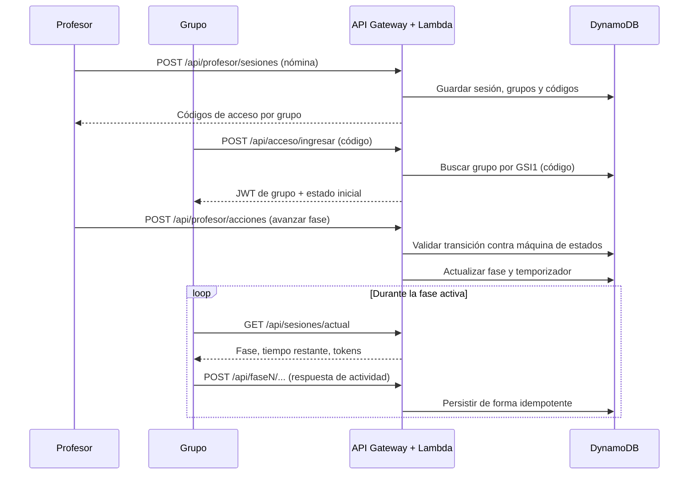
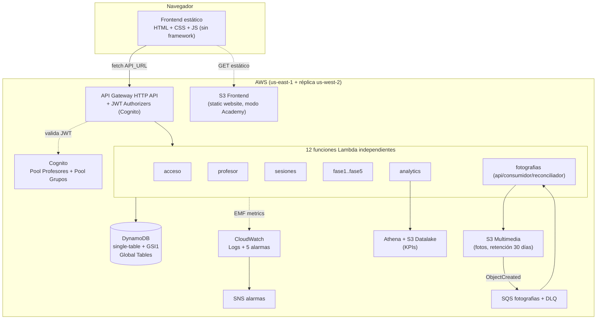
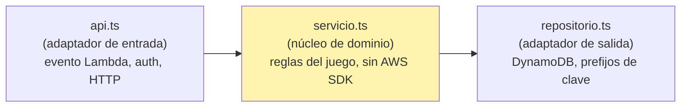
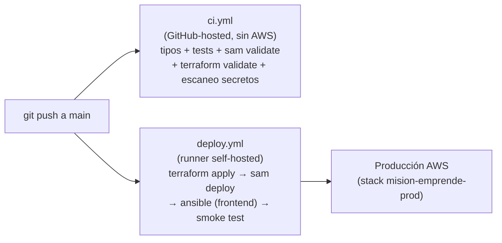

# UNIVERSIDAD DEL DESARROLLO — FACULTAD DE INGENIERÍA

## INFORME FINAL DE EXAMEN — ARQUITECTURA DE SISTEMAS
### "Misión Emprende UDD"

**Profesor:** Angel Rodrigo Nuñez Lopez
**Equipo:** Sebastián Ruiz, Leandro Añasco y Lucas Riquelme
**Carrera:** Ingeniería Civil Informática e Innovación Tecnológica
**Fecha:** 17/08/2026

---

## Índice

1. [Resumen ejecutivo](#1-resumen-ejecutivo)
2. [Descripción general del sistema](#2-descripción-general-del-sistema)
3. [Arquitectura de la solución](#3-arquitectura-de-la-solución)
4. [Infraestructura, despliegue y CI/CD](#4-infraestructura-despliegue-y-cicd)
5. [Patrones de diseño y resiliencia implementados](#5-patrones-de-diseño-y-resiliencia-implementados)
6. [Seguridad](#6-seguridad)
7. [Modelo de datos](#7-modelo-de-datos)
8. [Pruebas y calidad](#8-pruebas-y-calidad)
9. [Estado final por épica](#9-estado-final-por-épica)
10. [Lo que no se alcanzó a implementar](#10-lo-que-no-se-alcanzó-a-implementar)
11. [Incidentes reales resueltos durante el examen](#11-incidentes-reales-resueltos-durante-el-examen)
12. [Aprendizajes del ramo](#12-aprendizajes-del-ramo)
13. [Conclusiones](#13-conclusiones)

---

## 1. Resumen ejecutivo

Misión Emprende UDD es una plataforma educativa gamificada que permite a profesores de la Universidad del Desarrollo conducir sesiones de emprendimiento con grupos de estudiantes, organizadas en fases de colaboración, empatía, creatividad, presentación y evaluación cruzada.

Respecto del Certamen 2, el proyecto avanzó desde un backend serverless con fases 1 y 2 operativas hacia una plataforma **desplegada en producción real sobre AWS**, con siete épicas completadas: acceso seguro, gestión de sesiones/grupos, las seis fases del juego a nivel de dominio, evidencia fotográfica asíncrona, KPIs con contrato versionado, continuidad/recuperación ante fallos, y un pipeline de entrega continua gobernado por evidencia.

El sistema quedó **operativo y verificado en producción** durante el examen: se corrigieron errores reales encontrados en vivo (no solo en teoría), se resolvieron restricciones específicas del entorno AWS Academy, y se habilitó formalmente la carga de fotografías bajo una política de retención de 30 días. La Sección 11 documenta ese proceso de depuración en producción como evidencia de comprensión real del sistema, no solo de su construcción inicial.

| Aspecto | Estado final |
|---|---|
| Backend | Node.js 22 + TypeScript, 12 funciones Lambda independientes |
| Arquitectura | Serverless, Clean Architecture (api → servicio → repositorio) |
| Persistencia | DynamoDB single-table + Global Tables (réplica activa-activa) |
| Frontend | HTML/CSS/JS sin framework — fases 1, 2 y 3 con UI; fases 4-6 solo en backend |
| CI/CD | GitHub Actions: `ci.yml` (gates sin AWS) + `deploy.yml` (despliegue real, self-hosted) |
| Despliegue | Producción activa en AWS Academy, verificada end-to-end en este examen |
| Resiliencia | Circuit breaker, DLQ, idempotencia, bulkhead, chaos engineering automatizado |
| Observabilidad | CloudWatch Logs estructurados + 5 alarmas operables + tema SNS |

---

## 2. Descripción general del sistema

### 2.1. Actores y responsabilidades

| Rol | Responsabilidad |
|---|---|
| Profesor | Se autentica vía Cognito, crea sesiones importando una nómina Excel/CSV, controla las transiciones de fase, supervisa el avance. |
| Grupo de estudiantes | Ingresa mediante un código único de acceso, desarrolla las actividades de cada fase, acumula tokens. |
| Sistema (backend) | Es la única fuente de verdad: valida transiciones, calcula tokens y rankings, controla temporizadores por reloj de servidor. |

### 2.2. Fases del juego

| Fase | Actividad | Estado |
|---|---|---|
| Fase 1 | Sopa de letras colaborativa | Operativa (backend + frontend) |
| Fase 2 | Bubble Map de empatía | Operativa (backend + frontend) |
| Fase 3 | Prototipo LEGO + evidencia fotográfica | Operativa (backend + frontend + carga real a S3, habilitada en este examen) |
| Fase 4 | Presentación del pitch | Backend implementado (`f5_evaluacion_pitch`), **sin frontend** |
| Fase 5 | Evaluación cruzada entre pares | Backend implementado, **sin frontend** |
| Fase 6 | Ranking final | Backend implementado (`f6_ranking`), **sin frontend** |

### 2.3. Flujo operativo de una sesión

---

## 3. Arquitectura de la solución

### 3.1. Vista de componentes

### 3.2. Clean Architecture por módulo

Cada capacidad funcional (`acceso`, `profesor`, `sesiones`, `fase1`…`fase5`, `analytics`, `fotografias`) se organiza en tres archivos con una única dirección de dependencia:

- `servicio.ts` no importa el SDK de AWS ni conoce la forma del evento HTTP — depende de una interfaz que `repositorio.ts` implementa.
- Ningún módulo importa el repositorio de otro módulo: si una fase necesita datos de otra, lo hace vía un contrato explícito en `compartido/contratos/`.
- La máquina de estados del juego vive en un único lugar (`compartido/maquinaEstados.ts`); ningún módulo usa strings sueltos para representar fases.
- El frontend es deliberadamente "tonto": conserva el token, invoca endpoints y renderiza — toda regla de negocio vive en el backend.

---

## 4. Infraestructura, despliegue y CI/CD

### 4.1. Infraestructura como Código

- **Terraform** (`main.tf`): DynamoDB Global Table, buckets S3 (frontend, multimedia, datalake), SNS, SQS + DLQ, alarmas CloudWatch, Athena.
- **AWS SAM** (`backend-serverless/template.yaml`): 12 funciones Lambda, API Gateway HTTP con JWT Authorizers, Cognito User Pools.
- **Ansible** (`ansible/deploy.yml`): orquesta build + deploy de backend y frontend, con gates propios (tipos, tests, `sam validate`, `terraform fmt`) antes de tocar AWS.

### 4.2. Pipeline de entrega continua

**Decisión de diseño clave — AWS Academy vs. OIDC:** el diseño original de la Épica 7 contemplaba autenticación federada GitHub↔AWS vía OIDC (sin credenciales estáticas). Verificamos en vivo, contra la cuenta real, que **AWS Academy bloquea `iam:CreateRole`, `iam:CreateOpenIDConnectProvider`, `iam:CreateUser` y `iam:UpdateAssumeRolePolicy`** (política `Pvoclabs2` con deny explícito) — por lo tanto OIDC es técnicamente inviable en este entorno, sin importar la configuración del lado de GitHub. La solución adoptada fue un **runner self-hosted** de GitHub Actions, corriendo en una máquina con sesión de AWS Academy ya autorizada — reutiliza exactamente el mismo mecanismo de credenciales que el despliegue manual, sin crear ninguna identidad IAM nueva.

### 4.3. Entornos

`main.tf` expone `modo_academy` (fallback a S3 static website cuando CloudFront/OAC no están disponibles) y usa un backend Terraform local con ruta absoluta compartida entre el checkout del runner y el checkout manual, evitando drift de estado entre ambos.

---

## 5. Patrones de diseño y resiliencia implementados

| Patrón | Dónde | Propósito |
|---|---|---|
| Circuit Breaker | Failover DynamoDB (`fase*/repositorio.ts`) | Corta llamadas a la réplica tras fallos consecutivos; cooldown temporizado. |
| Dead Letter Queue + Redrive | `fotografias` (SQS + `fotografias_dlq`) | Aísla fallos terminales del procesamiento fotográfico sin bloquear la cola principal. |
| Idempotencia | Creación de sesiones, tokens por fase, procesamiento de fotos | Reintentos de red no duplican efectos (verificado con `solicitudId` / claves condicionales DynamoDB). |
| Bulkhead | Cola de fotos aislada de las Lambdas síncronas del juego | Un pico de cargas fotográficas no satura las fases interactivas. |
| Rate limiting | `POST /api/acceso/ingresar`, `POST /api/profesor/ingresar` | Throttling específico por ruta en API Gateway. |
| Chaos Engineering automatizado | `scripts/demostrar-regresion.ts`, experimentos 6.4/6.5 | Simula indisponibilidad regional y fallos del consumidor fotográfico de forma reversible y documentada. |

---

## 6. Seguridad

- **Cognito** con dos User Pools separados (Profesores / Grupos), cada uno con su propio Authorizer JWT en API Gateway — aislamiento estructural de roles, no solo lógico.
- **Autorización por claim** (`cognito:groups`) validada en cada Lambda antes de ejecutar lógica de negocio (`compartido/seguridad.ts`).
- **CORS estricto**: origen exacto del frontend, validado por una `Rule` de CloudFormation que exige HTTPS en modo productivo (con excepción explícita y auditable para modo Academy).
- **Escaneo de secretos** (`npm run escanear:secretos`) como gate obligatorio en CI.
- **Retención de datos**: política de 30 días para fotografías en S3 (lifecycle rule), aprobada formalmente y activada en este examen — antes del examen la carga estaba deliberadamente apagada (`CargasFotografiasHabilitadas: false`) hasta contar con esa aprobación explícita.

---

## 7. Modelo de datos

DynamoDB single-table con GSI1:

| Entidad | PK | SK | Acceso secundario |
|---|---|---|---|
| Sesión | `SESION#id` | `METADATOS` | GSI1 por `PROFESOR#profesorId` |
| Grupo | `SESION#id` | `GRUPO#grupoId` | GSI1 por `CODIGO#codigoAcceso` |
| Alumno | `SESION#id` | `ALUMNO#alumnoId` | — |

Los prefijos de clave y las consultas viven exclusivamente en `repositorio.ts`; ningún servicio conoce la forma física del almacenamiento.

---

## 8. Pruebas y calidad

**Lo que sí se probó (automatizado, 22 archivos de test, `vitest`):**
- Reglas de negocio por fase (tokens, idempotencia, transiciones válidas).
- Arquitectura hexagonal (imports prohibidos entre módulos, dirección de dependencia).
- Contratos desplegables (alineación SAM ↔ código ↔ frontend).
- Seguridad (parseo de claims JWT, aislamiento por rol — incluyendo el bug real de `cognito:groups` documentado en la Sección 11).
- Resiliencia (failover DynamoDB, bulkhead, consumidor de fotografías, mutaciones deliberadas para verificar que los tests realmente fallan si se rompe el comportamiento).
- Smoke test bloqueante end-to-end (navegador → API Gateway → Lambda → DynamoDB) como parte del pipeline de despliegue.

**Lo que no se alcanzó a probar en profundidad** — ver Sección 10.

---

## 9. Estado final por épica

| Épica | Nombre | Estado |
|---|---|---|
| 1 | Acceso seguro para profesores y grupos | Completa |
| 2 | Sesiones, grupos y control de fases | Completa |
| 3 | Recorrido de las 6 fases del juego (dominio) | Completa a nivel de backend; ver Sección 10 para el frontend |
| 4 | Evidencia fotográfica LEGO confiable | Completa, habilitada en producción durante este examen |
| 5 | Resultados y KPIs con contrato versionado | Completa |
| 6 | Continuidad y recuperación verificables | Completa |
| 7 | Entrega segura gobernada por evidencia (CI/CD) | Completa, con adaptación real a restricciones de AWS Academy |

---

## 10. Lo que no se alcanzó a implementar

Documentamos esto explícitamente porque entendemos que declarar los límites reales del trabajo es tan importante como declarar lo logrado.

1. **Frontend de la parte final del juego (fases 4, 5 y 6).** El dominio y las reglas de negocio para presentación del pitch, evaluación cruzada entre pares y ranking final **sí están implementadas y probadas en el backend** (`fase5/servicio.ts`, estados `f5_evaluacion_pitch` y `f6_ranking`), pero no existe la interfaz de usuario correspondiente — `frontend/juego/` solo contiene `fase1/`, `fase2/` y `fase3/`. Un grupo puede llegar hasta la fase 3 en el navegador; de ahí en adelante el juego solo es accionable vía llamadas directas a la API.

2. **UX/UI.** El frontend cumple su función (HTML/CSS/JS sin framework, sin reglas de negocio) pero no recibió trabajo de diseño de experiencia: no hay sistema de diseño, no se validó accesibilidad, no se hizo revisión de responsividad más allá de lo básico, y no se probó con usuarios reales (profesores/alumnos) fuera del equipo.

3. **Pruebas de profundidad suficiente.** La cobertura automatizada es sólida a nivel de unidad, arquitectura y contratos, pero **no incluye**:
   - Pruebas end-to-end de interfaz (tipo Playwright/Cypress) que recorran el flujo completo desde el navegador.
   - Pruebas de carga/estrés con múltiples sesiones y grupos concurrentes reales.
   - Pruebas de usabilidad con profesores reales conduciendo una sesión completa.
   - Cobertura de las fases 4-6 más allá del nivel de servicio (no hay frontend que probar todavía).

4. **Endurecimiento productivo pendiente fuera de AWS Academy.** El pipeline de despliegue actual depende de un runner self-hosted porque AWS Academy bloquea la creación de identidades IAM necesarias para OIDC. En una cuenta AWS persistente (no-Academy), correspondería migrar a OIDC real con roles de IAM dedicados, tal como estaba diseñado originalmente en la Épica 7.

5. **Limpieza de metadatos huérfanos.** Cuando una fotografía expira físicamente por la regla de retención de 30 días, sus metadatos de auditoría en DynamoDB no se limpian automáticamente (documentado como pendiente desde la Épica 4).

---

## 11. Incidentes reales resueltos durante el examen

Esta sección documenta el proceso real de puesta en producción durante el examen — no forma parte del desarrollo original, sino de la verificación en vivo del sistema ya construido, lo que a nuestro juicio demuestra comprensión operativa real y no solo capacidad de construcción:

| # | Síntoma observado | Causa raíz | Corrección |
|---|---|---|---|
| 1 | Importación de Excel de grupos no hacía nada | `try` faltante en `crear-sesion.js` — error de sintaxis que rompía el parseo de todo el archivo, sin registrar ningún listener | Se restauró el bloque `try` |
| 2 | `deploy.yml` fallaba en Terraform: recursos "ya existen" | El runner self-hosted hace checkout en una carpeta distinta a la del despliegue manual; el estado de Terraform (local, no versionado) no era compartido | Backend Terraform con ruta absoluta fija, compartida entre ambos checkouts |
| 3 | Falla de CloudFront (`AccessDenied`) | Terraform corría con `modo_academy=false` por defecto; CloudFront/OAC están bloqueados en AWS Academy | Se pasó `modo_academy=true` de forma consistente en los 4 puntos donde el pipeline lo necesitaba |
| 4 | `sam deploy` fallaba: `OrigenCors` debía ser HTTPS | El parámetro `ModoDespliegue` seguía hardcodeado en `productivo` pese al modo Academy (HTTP) | Se alineó `ModoDespliegue=academy` |
| 5 | `ArnTemaAlarmas` faltante en el `sam deploy` interno de Ansible | El parámetro se agregó al template en la Épica 6 pero nunca se propagó al playbook de Ansible | Se capturó el output de Terraform y se pasó al `sam deploy` |
| 6 | Dos stacks de CloudFormation distintos activos simultáneamente | El workflow de despliegue directo usaba un nombre de stack distinto al que usa Ansible internamente | Se unificó a `mision-emprende-prod`, consistente con el resto de los recursos |
| 7 | Login de profesor exitoso pero `403 Rol de identidad inválido` en toda acción de profesor | `gruposDesdeClaim` asumía que `cognito:groups` llegaba como JSON válido con comillas; API Gateway HTTP API en realidad lo entrega como `[PROFESOR]` (corchetes sin comillas, no es JSON) — `JSON.parse` fallaba y el `catch` devolvía silenciosamente una lista vacía de roles | Se reescribió el parseo sin `JSON.parse`, con test de regresión agregado que reproduce el formato real de AWS |
| 8 | Carga de fotografías devolvía `503` | Feature flag `CargasFotografiasHabilitadas` apagado a propósito, pendiente de aprobación formal de política de retención | Se aprobó la retención de 30 días y se habilitó consistentemente en Terraform, SAM y Ansible |

Todos estos hallazgos se verificaron contra AWS real (no simulados): se generaron tokens JWT reales, se leyeron logs de CloudWatch, se corrieron `terraform plan` antes de cada cambio, y se usó `aws iam simulate-principal-policy` para confirmar las restricciones de Academy antes de intentar (y fallar) las operaciones reales.

---

## 12. Aprendizajes del ramo

Este examen nos permitió cerrar el ciclo entre **diseñar** arquitectura y **operar** un sistema real bajo restricciones reales de infraestructura:

- **La arquitectura en papel y la arquitectura en producción no son lo mismo.** El diseño de la Épica 7 asumía OIDC; la cuenta real de AWS Academy lo hacía imposible. Aprendimos a verificar restricciones de plataforma empíricamente (`iam simulate-principal-policy`) en vez de asumir que un patrón "correcto" en general es viable en un entorno específico.
- **El estado distribuido es frágil si no se gestiona explícitamente.** El bug del backend de Terraform (dos checkouts, un solo archivo de estado local) es un ejemplo directo de por qué el curso enfatiza IaC con backends remotos — en un entorno sin esa restricción de Academy, la solución correcta habría sido un backend S3+DynamoDB desde el principio.
- **Los contratos entre sistemas fallan en los bordes, no en el centro.** El bug de `cognito:groups` no estaba en la lógica de negocio ni en Cognito — estaba en el supuesto (nunca verificado contra el proveedor real) de cómo API Gateway serializa un claim array. Nos enseñó a no confiar en el formato de un dato de un sistema externo sin haberlo inspeccionado directamente.
- **La duplicación de configuración es una fuente sistemática de bugs.** Tres de los ocho incidentes (modo_academy, ArnTemaAlarmas, nombre de stack) vinieron de la misma causa raíz: dos invocaciones paralelas e independientes (el paso directo del workflow y el playbook de Ansible) que debían mantenerse sincronizadas manualmente. Es el mismo problema de fondo que la materia de consistencia distribuida — una sola fuente de verdad reduce clases enteras de errores.
- **La resiliencia (circuit breaker, DLQ, idempotencia, bulkhead) solo tiene valor si se puede demostrar, no solo declarar.** Por eso el proyecto incluye experimentos de caos automatizados y reproducibles, no solo el código del patrón.
- **Gobernar la seguridad de una feature es tan importante como construirla.** El flag de cargas fotográficas quedó deliberadamente apagado hasta contar con una decisión explícita de retención de datos — separar "está construido" de "está autorizado para producción" fue una decisión consciente del equipo, no un olvido.

---

## 13. Conclusiones

El proyecto demuestra la aplicación práctica de los pilares centrales del ramo: arquitectura serverless con Clean Architecture, patrones de resiliencia distribuida verificables, infraestructura como código, entrega continua gobernada por evidencia, y seguridad basada en identidad federada.

Más allá del código construido, este examen puso a prueba la comprensión operativa del sistema: depurar en producción real, bajo restricciones de plataforma no anticipadas (AWS Academy), usando evidencia directa (tokens reales, logs de CloudWatch, simulación de políticas IAM) en vez de suposiciones. Los pendientes declarados en la Sección 10 —frontend de las fases finales, profundidad de UX/UI y pruebas end-to-end— son honestos y quedan como la ruta de trabajo natural de continuar el proyecto más allá de este curso.
