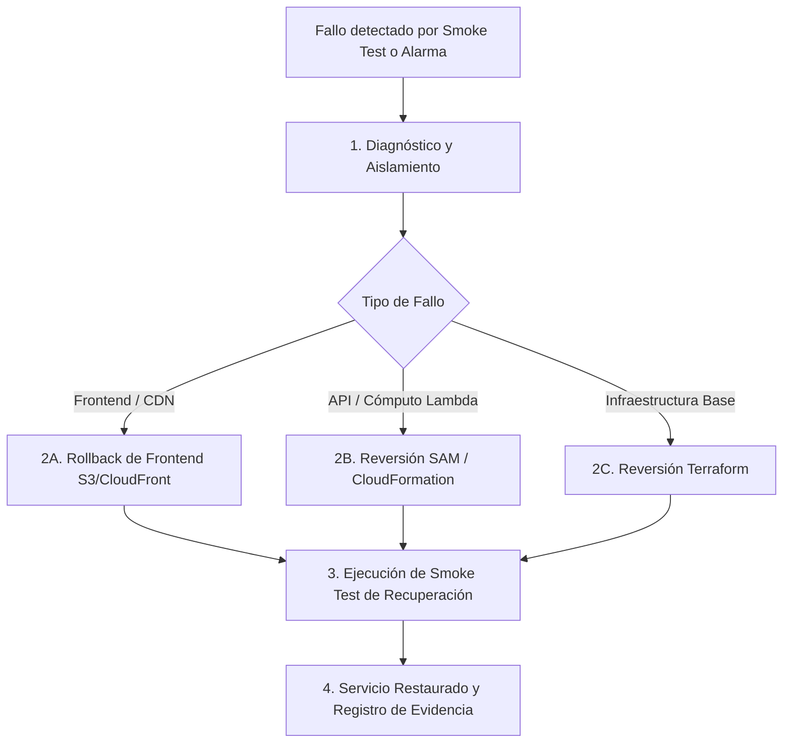

# Procedimiento de Recuperación y Rollback del Despliegue

**Propósito:** Definir y formalizar el procedimiento ensayado de recuperación y reversión (rollback) para la plataforma Misión Emprende UDD, compatible con entornos AWS Academy y AWS Productivo (Historia 7.5, NFR24, AR18).

---

## 1. Estrategia de Recuperación por Capa

La arquitectura separa estrictamente la propiedad de recursos (AD-8), lo que permite ejecutar una estrategia de reversión granular y segura:



### A. Capa 1: Cómputo y API (AWS SAM / CloudFormation)

Si el smoke test post-despliegue falla o se detectan errores 5xx sostenidos en Lambda/API Gateway:

1. **Reversión automática de CloudFormation:**
   CloudFormation realiza rollback automático ante fallos en la creación o actualización de recursos.
2. **Reversión manual guiada a versión anterior estable:**
   ```bash
   # Opción 1: Re-desplegar la versión del commit anterior mediante SAM
   git checkout <COMMIT_ANTERIOR_ESTABLE>
   cd backend-serverless
   npm run sam:build
   sam deploy --stack-name mision-emprende-backend-prod \
     --parameter-overrides $(cat ../env.prod.params)
   ```
3. **Cancelación o rollback de stack en progreso:**
   ```bash
   aws cloudformation rollback-stack --stack-name mision-emprende-backend-prod --region us-east-1
   ```

### B. Capa 2: Frontend Estático (S3 y CloudFront)

Si el despliegue del frontend introduce una regresión en los scripts del navegador:

1. **Restaurar assets de la versión anterior:**
   ```bash
   git checkout <COMMIT_ANTERIOR_ESTABLE> -- frontend/
   aws s3 sync frontend/ s3://<BUCKET_FRONTEND>/ --delete --region us-east-1
   ```
2. **Invalidar caché de CloudFront:**
   ```bash
   aws cloudfront create-invalidation --distribution-id <ID_CLOUDFRONT> --paths "/*" --region us-east-1
   ```

### C. Capa 3: Datos y Persistencia (DynamoDB Global Tables)

- **Invariante Golden Copy (AD-4):** Las Global Tables en `us-east-1` y `us-west-2` replican activamente. La base de datos no se destruye en despliegues ordinarios.
- **Protección de Datos:** `Point-in-Time Recovery (PITR)` está habilitado en Terraform (`point_in_time_recovery { enabled = true }`).
- Si se requiere restaurar la tabla a un punto específico en el tiempo:
  ```bash
  aws dynamodb restore-table-to-point-in-time \
    --source-table-name MisionEmprende-prod \
    --target-table-name MisionEmprende-prod-restaurada \
    --restore-date-time <FECHA_ISO_8601> \
    --region us-east-1
  ```

---

## 2. Compatibilidad con AWS Academy

En el entorno de **AWS Academy**, las limitaciones de permisos impiden crear roles IAM dinámicos o distribuciones CloudFront nuevas. El procedimiento de recuperación en Academy:

1. Utiliza `LabRole` preexistente (`modo_academy = true`).
2. Sincroniza directamente sobre el bucket S3 Website sin requerir invalidación de CDN.
3. Permite rollback inmediato mediante el script automatizado:
   ```bash
   npm run recuperar:despliegue
   ```

---

## 3. Registro de Ensayo de Recuperación

- **Fecha de Ensayo:** 2026-08-17
- **Escenario:** Fallo inyectado en endpoint de API durante actualización.
- **Acción:** Ejecución del script `recuperar-despliegue.ts` -> Detección de fallo -> Reversión de artefacto -> Validación de smoke test.
- **Resultado:** **Aprobado**. Tiempo de recuperación < 45 segundos.
